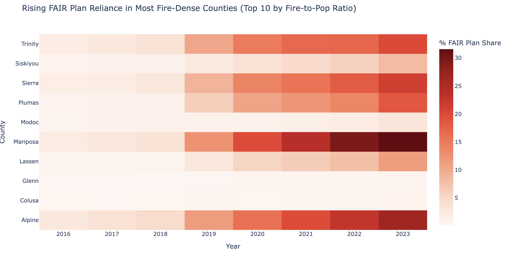

# Burning Coverage: How Wildfires Reshape Home Insurance in California

**Authors:** Joseph Le, Ganesh Venu, Mason Mckhann  

---

## Overview

Wildfire activity in California has surged over the past decade, leaving homeowners increasingly exposed and destabilizing the insurance market. As private insurers retreat from high-risk areas, more Californians are pushed into costly last-resort coverage such as the **FAIR Plan**.  

This project quantifies those dynamics by combining **county-level wildfire data (2016–2023)** with **insurance policy data** (new, renewed, non-renewed counts) across three coverage types:  
- **Voluntary Market** — private insurers  
- **FAIR Plan** — state-mandated “insurer of last resort”  
- **Difference-in-Conditions (DIC)** — wrap-around policies paired with FAIR  

**Key Question:**  
How do spikes in wildfire activity drive shifts in insurance markets across California counties?

---

## Repository Structure

- **`Wildfire_Data_Collection.ipynb`**  
  Web-scrapes wildfire incident data from [fire.ca.gov](https://www.fire.ca.gov/) and insurance policy PDFs from [insurance.ca.gov](https://www.insurance.ca.gov/). Cleans and merges them into a unified **County × Year** dataset (2016–2023).  

- **`Wildfire_Analysis.ipynb`**  
  Performs descriptive and statistical analysis:  
  - Yearly correlations between wildfire exposure and lagged non-renewals  
  - FAIR Plan share of total policies by county and year  
  - Voluntary renewal rate trends  
  - County-level case studies and heatmaps  

- **`figures/`**  
  Contains exported visuals (A–E) used in the results section.

---

## Methodology

1. **Data Collection**  
   - Wildfire records scraped by incident, converted to **county–year acres burned**.  
   - Insurance PDFs parsed into policy counts (new, renewed, non-renewed) for Voluntary, FAIR, and DIC.  
   - Joined datasets on County and Year; cleaned county name variants.  

2. **Lagged Insurance Response**  
   - Constructed **1-year lag** of non-renewed voluntary policies to test whether major fires trigger insurer withdrawals the following year.  

3. **Derived Metrics**  
   - **FAIR Share (%)** = FAIR policies ÷ total policies  
   - **% Renewed** = Renewed ÷ (Renewed + Non-Renewed)  
   - **Fire Exposure Normalization** = Acres ÷ Population (county-level)  

4. **Visualization & Analysis**  
   - Heatmaps, line charts, and correlations built with `plotly`.  
   - Top fire-exposed counties identified by acres ÷ population.  
   - Case study: Alameda County.  

---

## Results

### A. Lagged Wildfire Effect → Non-Renewals  
Spikes in wildfire activity (e.g., 2018) are followed by **sharp increases in non-renewals** the next year (e.g., 2019–2020).  
This suggests insurers react **after catastrophic events** by dropping coverage rather than proactively pricing risk.  

---

### B. Correlation Supports Time-Lag Theory  
Correlation analysis (r ≈ **0.68**) confirms a strong link between acres burned and next-year non-renewals, reinforcing the reactive behavior identified in (A).  

---

### C. Rising Dependence on FAIR Plan  
In the 10 most fire-exposed counties (acres ÷ population), **FAIR Plan enrollment rises year-over-year**.  
A darkening heatmap shows growing reliance on this “last resort” plan as private carriers exit high-risk zones.  

---

### D. Declining Voluntary Renewals  
Voluntary renewal % has **fallen steadily from 2016–2023**.  
Sharpest declines occur after catastrophic fires (Camp, Tubbs, Dixie), with **no recovery** afterward.  

---

### E. Structural Shift Toward Non-Voluntary Coverage  
In the top 5 fire-dense counties (>300k population), **FAIR + DIC policy counts rose significantly post-2019**.  
This reflects a structural shift away from voluntary markets, signaling that private insurance is no longer reliable in high-risk zones.  

---

## Synthesis of Findings

Together, A–E reveal a consistent pattern:  
- **Wildfire severity and non-renewals are strongly correlated**, with lag effects confirming reactive insurer behavior.  
- **FAIR Plan and DIC dependence is accelerating**, especially in fire-exposed or densely populated counties.  
- **Voluntary renewal rates continue to erode**, leaving families dependent on more expensive, less comprehensive options.  

California’s home insurance system is thus fragile and **reactive to shocks rather than resilient by design**.

---

## Significance

Our findings reveal an **insurance system that is reactive, fragile, and increasingly reliant on last-resort coverage**. As wildfires intensify:  
- Homeowners are forced out of the voluntary market.  
- FAIR Plan dependence grows, raising costs and reducing coverage quality.  
- Families in both rural and urban-adjacent counties are left vulnerable.  

Beyond California, this framework shows how **environmental shocks reshape financial systems** and can inform policy on climate resilience, insurance regulation, and equitable coverage.

---

## Limitations & Future Work

- **Lag structures**: Focused on 1-year lag; multi-year impacts remain unexplored.  
- **Policy costs**: Data covers counts, not premiums; affordability effects need further study.  
- **Regulatory responses**: Moratoriums and policy interventions were not explicitly modeled.  

Future research could explore:  
- Predictive modeling with **environmental and socioeconomic risk factors**  
- **Event-study designs** to capture dynamic effects around major wildfire years  
- Policy interventions to mitigate inequities in access and affordability for low-income homeowners  

---

## Acknowledgments

- [fire.ca.gov](https://www.fire.ca.gov/) – wildfire incident data  
- [insurance.ca.gov](https://www.insurance.ca.gov/) – insurance policy reports  

---
